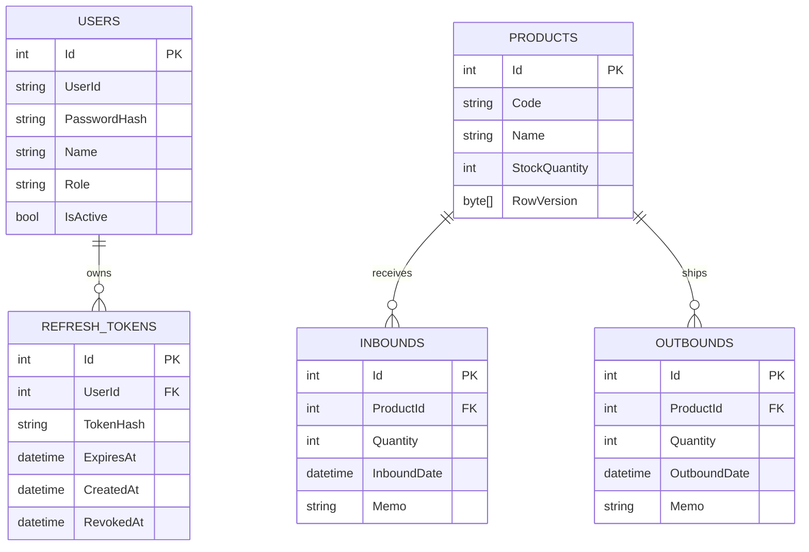

# SmartWMS

ASP.NET Core 기반 WMS(Warehouse Management System) REST API 프로젝트입니다.

상품 / 입고 / 출고 / 재고 관리 기능을 중심으로  
JWT 인증·인가, Refresh Token Rotation, 동시성 제어, Integration Test,
Health Check, Docker 실행 환경까지 구현했습니다.

---

## Tech Stack

**Backend**

- C#
- .NET 8
- ASP.NET Core Web API
- Entity Framework Core 8

**Database**

- SQL Server
- SQL Server LocalDB
- EF Core Migration

**Authentication**

- JWT Access Token
- Refresh Token
- Role Based Authorization

**Testing / DevOps**

- xUnit
- WebApplicationFactory
- Integration Test
- Docker
- Docker Compose
- SQL Server 2022 Container

---

# 주요 기능

### 상품 관리

- 상품 CRUD
- 상품 코드 중복 검증
- 검색 및 Server Side Paging
- ADMIN 전용 상품 삭제
- 재고가 남은 상품 삭제 방지

### 입출고 / 재고

- 입고 시 재고 증가
- 출고 시 재고 감소
- 재고 부족 시 `409 Conflict`
- 상품별 입출고 이력
- 입출고 통합 재고 이력
- 기간 / 유형 / 상품 검색
- Paging

### 인증 / 인가

- 회원가입 / 로그인
- JWT Access Token
- USER / ADMIN Role
- 관리자 사용자 관리
- 비활성 계정 로그인 차단

### Refresh Token

- Refresh Token SHA-256 Hash 저장
- Access Token 재발급
- Refresh Token Rotation
- 사용된 Token 재사용 차단
- 만료 / 폐기 / 비활성 사용자 검증

### 안정성

- EF Core Optimistic Concurrency
- `RowVersion` 기반 충돌 감지
- 동시 출고 요청 정합성 검증
- Global Exception Handling
- Database Health Check

---

# ERD



---

# API

## Auth

| Method | Endpoint | 권한 | 설명 |
|---|---|---|---|
| POST | `/api/Auth/register` | Public | 회원가입 |
| POST | `/api/Auth/login` | Public | 로그인 및 Token 발급 |
| GET | `/api/Auth/me` | Login | 현재 사용자 조회 |
| POST | `/api/Auth/refresh` | Public | Access / Refresh Token 재발급 |

## Product

| Method | Endpoint | 권한 | 설명 |
|---|---|---|---|
| GET | `/api/Product` | Login | 상품 검색 / Paging |
| GET | `/api/Product/{id}` | Login | 상품 조회 |
| POST | `/api/Product` | Login | 상품 등록 |
| PUT | `/api/Product/{id}` | Login | 상품 수정 |
| DELETE | `/api/Product/{id}` | ADMIN | 상품 삭제 |

## Inbound

| Method | Endpoint | 권한 | 설명 |
|---|---|---|---|
| POST | `/api/Inbound` | Login | 입고 등록 |
| GET | `/api/Inbound` | Login | 전체 입고 이력 |
| GET | `/api/Inbound/{id}` | Login | 입고 단건 조회 |
| GET | `/api/Inbound/product/{productId}` | Login | 상품별 입고 이력 |

## Outbound

| Method | Endpoint | 권한 | 설명 |
|---|---|---|---|
| POST | `/api/Outbound` | Login | 출고 등록 |
| GET | `/api/Outbound` | Login | 전체 출고 이력 |
| GET | `/api/Outbound/{id}` | Login | 출고 단건 조회 |
| GET | `/api/Outbound/product/{productId}` | Login | 상품별 출고 이력 |

## Stock

| Method | Endpoint | 권한 | 설명 |
|---|---|---|---|
| GET | `/api/Stock/history` | Login | 통합 재고 이력 검색 / Paging |
| GET | `/api/Stock/history/product/{productId}` | Login | 상품별 재고 이력 |

## Users

| Method | Endpoint | 권한 | 설명 |
|---|---|---|---|
| GET | `/api/Users` | ADMIN | 사용자 목록 |
| GET | `/api/Users/{id}` | ADMIN | 사용자 조회 |
| PUT | `/api/Users/{id}/role` | ADMIN | Role 변경 |
| PUT | `/api/Users/{id}/active` | ADMIN | 활성 상태 변경 |

---

# 핵심 구현 포인트

### Refresh Token Rotation

로그인 시 Access Token과 Refresh Token을 함께 발급합니다.

Refresh Token 원문은 Database에 저장하지 않고
SHA-256 Hash 값만 저장합니다.

Token 재발급 성공 시 기존 Refresh Token을 폐기하고
새로운 Refresh Token을 발급합니다.

따라서 이미 사용된 Refresh Token의 재사용을 차단합니다.

### Optimistic Concurrency

`Product.RowVersion`을 이용해 동시성 충돌을 감지합니다.

동일한 재고에 여러 출고 요청이 동시에 발생하는 상황도
Integration Test를 통해 검증했습니다.

### Integration Test

`WebApplicationFactory`를 사용해 실제 HTTP 요청부터
Database 처리까지 검증하는 Integration Test를 구성했습니다.

주요 검증 대상:

- Authentication / Authorization
- 상품 CRUD
- 입고 / 출고
- 재고 부족
- 동시 출고
- RowVersion
- 관리자 사용자 관리
- Refresh Token Rotation
- Health Check

---

# Docker

Docker Compose를 이용해 API와 SQL Server를 함께 실행합니다.

```text
Docker Compose
│
├── smartwms-api
│   └── ASP.NET Core Web API
│
└── smartwms-sqlserver
    └── SQL Server 2022
```

## Environment Variables

민감한 설정은 `.env`를 통해 관리합니다.

```env
SA_PASSWORD=YourStrongPassword
JWT_KEY=YourStrongJwtSecretKey
```

`.env`는 `.gitignore`에 포함해 Repository에 업로드하지 않습니다.

## 실행

```bash
docker compose up -d --build
```

Container 확인:

```bash
docker ps
```

Health Check:

```text
http://localhost:8080/health
```

정상 상태:

```text
Healthy
```

Swagger:

```text
http://localhost:8080/swagger
```

---

# Database Migration

Docker SQL Server 실행 후 Migration을 적용합니다.

```bash
dotnet ef database update \
  --project SmartWMS.Api \
  --connection "Server=localhost,1433;Database=SmartWMS;User Id=sa;Password=YOUR_PASSWORD;TrustServerCertificate=True;Encrypt=False;"
```

---

# Project Structure

```text
SmartWMS
│
├── SmartWMS.Api
├── SmartWMS.Api.Tests
│
├── Dockerfile
├── docker-compose.yml
├── .dockerignore
└── README.md
```

---

# 프로젝트를 통해 학습한 내용

- ASP.NET Core Web API
- REST API 설계
- Entity Framework Core
- LINQ / IQueryable
- JWT Authentication / Authorization
- Refresh Token Rotation
- Optimistic Concurrency
- Global Exception Handling
- Integration Test
- Health Check
- Docker / Docker Compose
- 환경변수 기반 Secret 관리

---

# 향후 개선 가능 사항

- Service Layer 분리
- Structured Logging
- CI/CD Pipeline
- Cloud 배포
- Monitoring